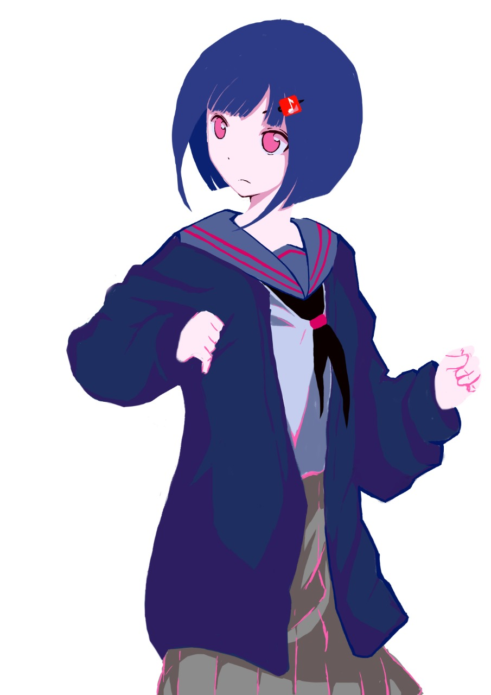

# start.github.io
<!DOCTYPE html>
<html>
<head>
	<title></title>
	
    
	<link rel="stylesheet" type="text/css" href="styles.css">
	
</head>

<body onload="GO()">
<!-- decorationBlackBlock -->

<!-- BackRedColor -->

<!-- BackRedColor -->

<!-- FrontBlackColor -->
 

 	

 	

 	

 	

 	

 	

 	

	

<!-- SombraRojita Bloque1 -->

<!-- interativeBlock Bloque1 -->

	

	

	

	

	
 
Acordes
  

	
 
Acordes
  

	
 
Acordes
  

	
 
Acordes
  

<!-- Bloque de decoración Kazumi -->

<!-- Bloque de Kazumi -->

	
	

		

	

<!-- Consola de texto de Kazumi -->

 

<!-- Detector de mouse / Desplazador de herramientas -->

	
PLAY

	
STOP

	
DRAW A NEW HAND

	
	
RESET

	
BACK

	

	

</body>
</html>
